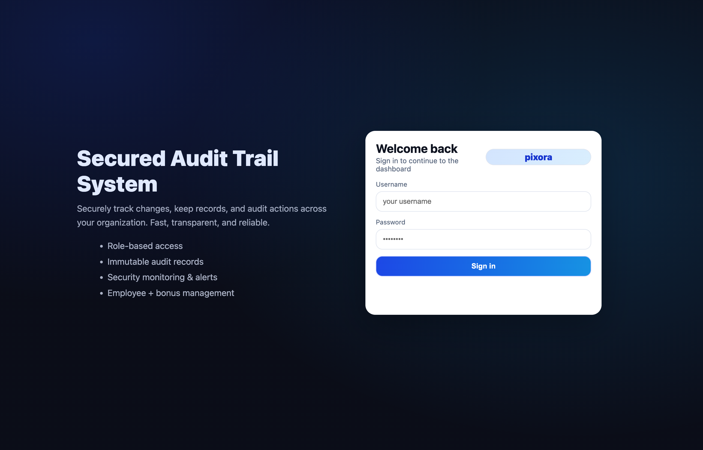
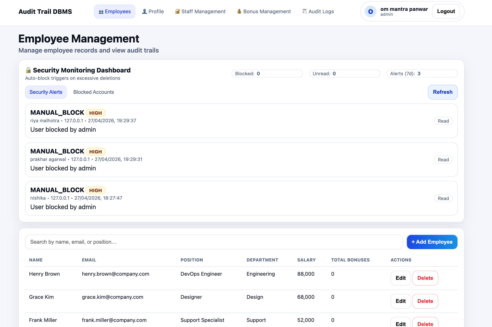
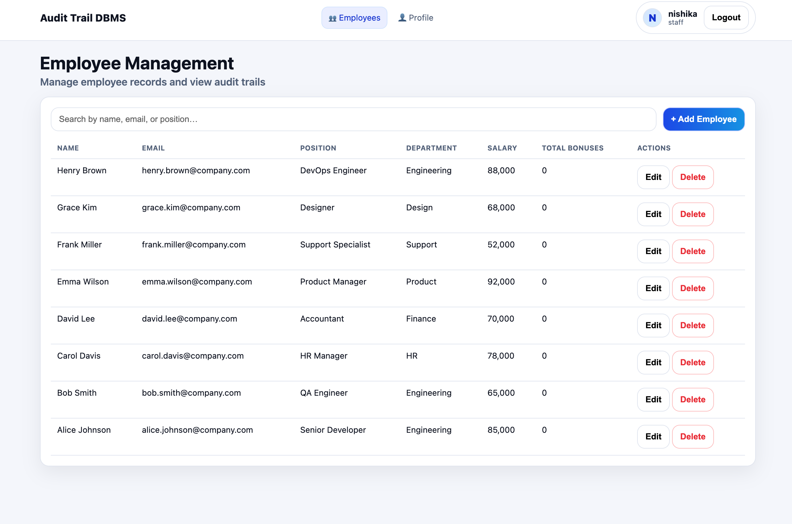
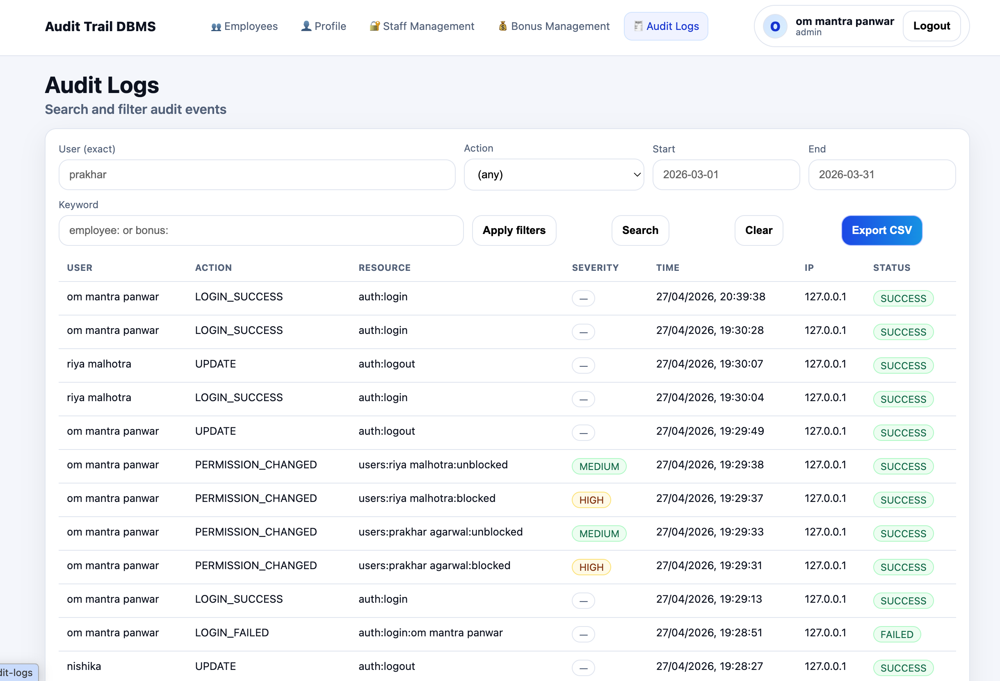
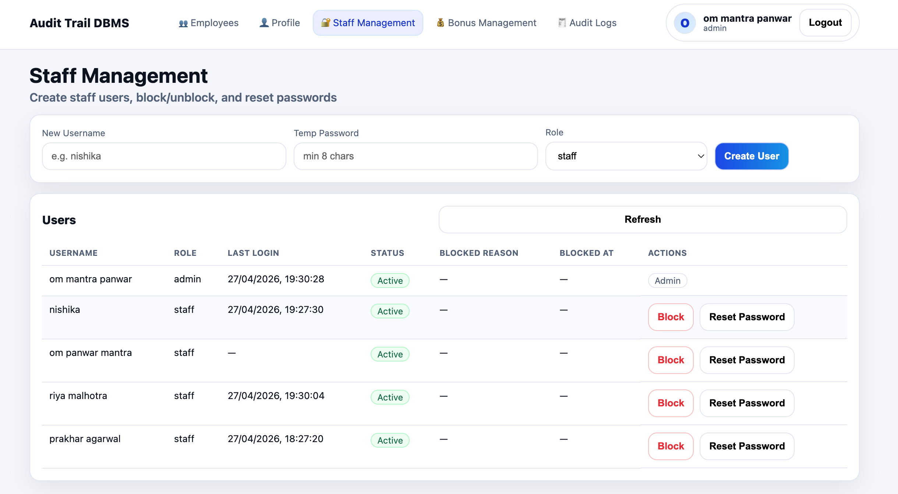

# 🛡️ Audit Trail System

A secure full-stack Audit Trail System designed to track, monitor, and manage user activities within an organization. It ensures transparency, accountability, and security by recording every important action performed in the system.

---

## 📸 Screenshots

### Login Page


---

### Admin Dashboard


---

### Employee Dashboard


---

### Audit Logs


---

### Staff Management


---

## 🎯 Overview

This system captures detailed logs of user activity, including:

- Who performed the action  
- What action was performed  
- When it occurred  
- From where (IP/device)  
- Result of the action  

It ensures full transparency and traceability across all system operations.

---

## ✨ Key Features

### 🔐 Authentication & Authorization
- Secure login using bcrypt password hashing  
- JWT-based authentication  
- Role-Based Access Control (Admin & Staff)

---

### 📜 Audit Logging System
- Append-only logs (cannot be modified or deleted)
- Tracks:
  - Login attempts  
  - Employee CRUD operations  
- Stores `old_values` and `new_values` for full traceability  

---

### 👨‍💼 Employee Management
- Full CRUD operations  
- Search and filtering  
- Department-based organization  
- All actions automatically logged  

---

### 📊 Admin Dashboard
- View all audit logs  
- Filter by user, action, and date  
- Search logs by keyword  
- Export logs as CSV  

---

### 🚨 Security Monitoring
Detects:
- Multiple failed login attempts  
- Excessive deletions  
- Suspicious activity patterns  

Automatically blocks suspicious users and allows admin review.

---

## 🛠️ Tech Stack

**Backend**
- Node.js  
- Express.js  

**Database**
- MongoDB Atlas  

**Frontend**
- HTML  
- CSS  
- Vanilla JavaScript  

---

## 📁 Project Structure

```
audit-trail-system/
│
├── backend/        # Server, APIs, database logic
├── frontend/       # UI (HTML, CSS, JS)
├── api/            # API entry (for deployment)
├── README.md
```

---

##  Setup Instructions

### 1️⃣ Clone the repository


- Admin: `om mantra panwar` / `admin123`
- Staff: `riya malhotra` / `staff123`
- Staff: `prakhar agarwal` / `staff123`
- Staff: `nishika` / `staff123`

```
git clone https://github.com/Ommantrapanwar/audit-trail-system.git
```


---

### 2️⃣ Install dependencies

```
cd backend
npm install
```

---

### 3️⃣ Configure environment variables

Create a `.env` file in `backend/`:

```
PORT=5000
MONGO_URI=your_mongodb_connection_string
JWT_SECRET=your_secret_key
```

---

### 4️⃣ Seed the database

```
node scripts/seed.js
```

---

### 5️⃣ Run the server

```
npm start
```

---

### 6️⃣ Open the application

```
http://127.0.0.1:5001
```

---

##  Seeded Users (for testing)

Pre-configured users are available for quick testing:

###  Admin

* **Username:** om mantra panwar 
* **Password:** admin123

---

###  Staff Users

* **Username:** riya malhotra

* **Password:** staff123

* **Username:** om panwar mantra

* **Password:** staff123

* **Username:** nishika

* **Password:** staff123

* **Username:** prakhar agarwal

* **Password:** staff123

---

###  Notes

* Run the seed script before login:

  ```
  node scripts/seed.js
  ```
* Admin users can:

  * Access audit logs
  * Manage security alerts
* Staff users have restricted access

---

##  What I Learned

* Building secure authentication systems using JWT
* Implementing role-based access control (RBAC)
* Designing audit logging systems
* Working with MongoDB Atlas
* Developing REST APIs using Express
* Debugging and integrating full-stack applications

---

##  Author

**Om Panwar**

---

##  Future Improvements

* Real-time alerts for suspicious activities
* UI upgrade using modern frameworks (React)
* Advanced analytics dashboard
* Role management interface

---
